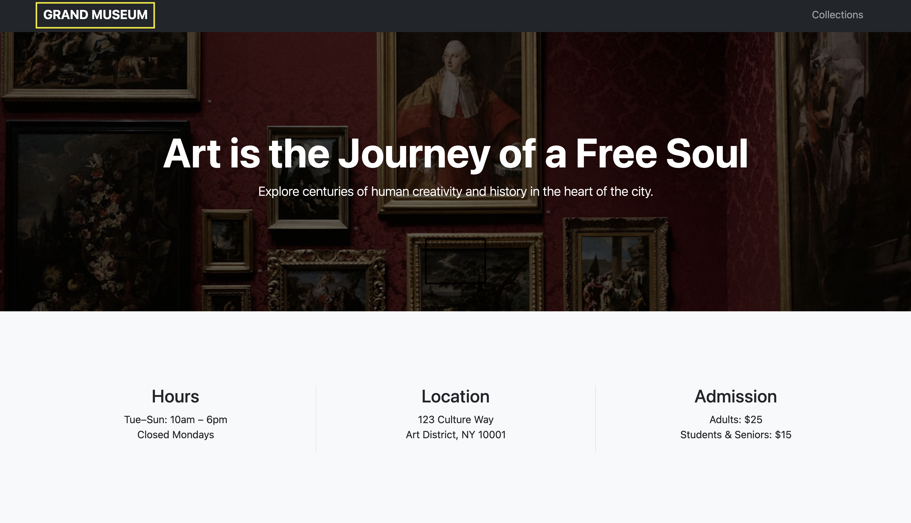
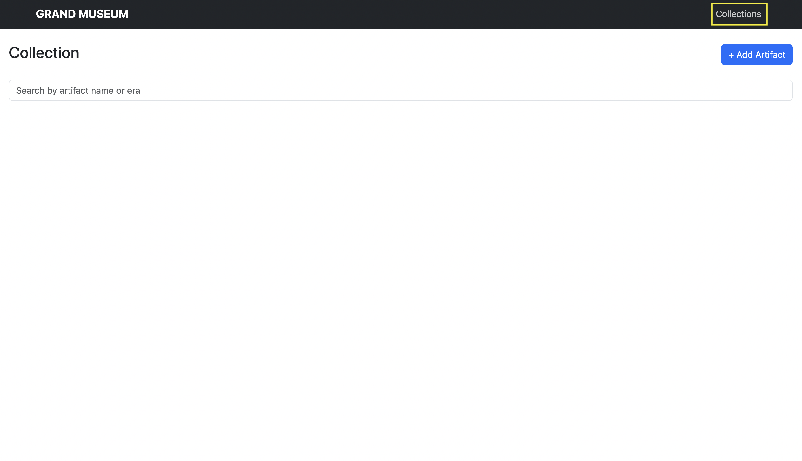
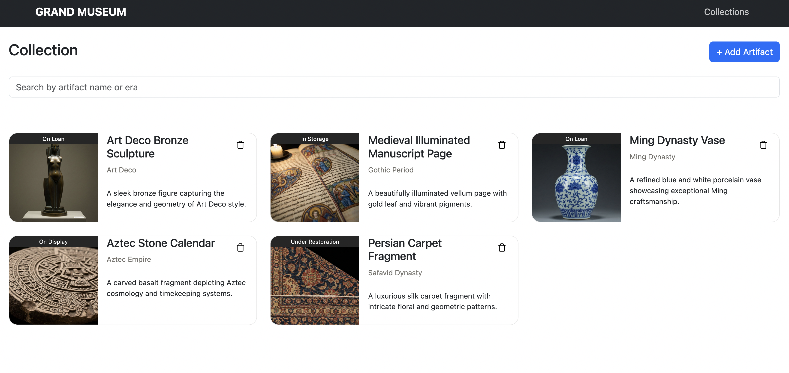
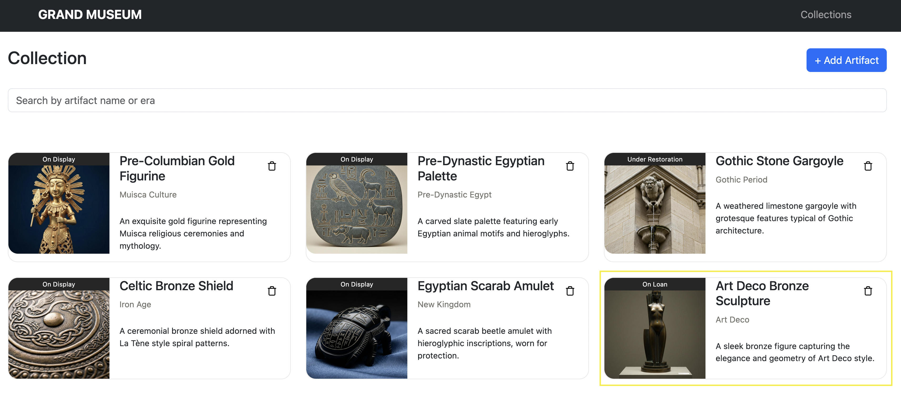
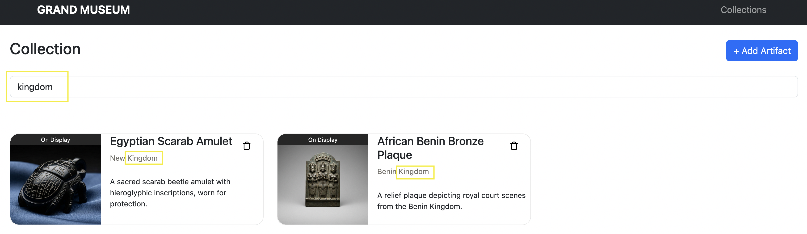
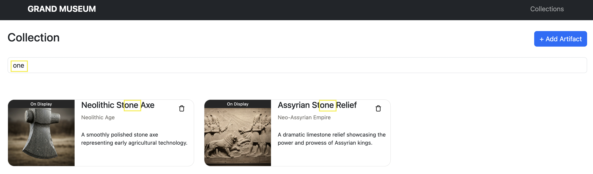

# Module examen JavaScript - Maart 2026

Tijdens dit examen bouw je een eenvoudige website voor een museum. 
De website bestaat uit een homepagina en een overzicht van de collectie van het museum. 
Deze collectie kan bewerkt en gefilterd worden. 

## Pagina's & navigatie (2 punten)

De applicatie bevat twee pagina's, de HTML voor elk van deze pagina's is van elkaar te onderscheiden door de CSS-klasse
die hieraan gekoppeld is. 
Alle elementen met de `home-page` klasse (of kinderen van zo'n elementen) mogen enkel op de homepagina zichtbaar zijn en 
alle elementen met de `collection-page` klasse (of kinderen van zo'n elementen) enkel op de collection pagina. 
Als een element (of een parent daarvan) geen van deze klassen heeft, moet dit element op alle pagina's zichtbaar zijn, 
zoals de navbar.

Zorg ervoor dat de gebruiker tussen de twee pagina's kan navigeren via de navigatiebalk bovenaan de pagina.
Als op de 'Grand museum' knop gedruk wordt, moeten alle elementen met de `collection-page` klasse verborgen worden en 
ziet de website er als volgt uit.

Als op de 'Collections' knop gedruk wordt, moeten alle elementen met de `home-page` klasse verborgen worden en
ziet de website er als volgt uit.

Hint: Aangezien de rest van het examen enkel code voor de collection page bevat, kan je de standaard pagina eventueel 
aanpassen van de homepagina naar de collectiepagina.

## Ophalen van artefacten (3 punten)

Haal via een **asynchrone functie** en een fetch de items van de API op die in de collectie van het museum zitten en 
plaats deze in een globale variabele.
Hiervoor gebruik je onderstaande URL.

[https://vaolhgulafwfxgrqpngy.supabase.co/functions/v1/museum](https://vaolhgulafwfxgrqpngy.supabase.co/functions/v1/museum)

De API geeft een array van artefacten terug (historische objecten die eigendom zijn van een museum), voor elk artefact 
zijn volgende properties beschikbaar. 

- `id`: Een getal. De primary key.
- `name`: Een string die de naam van het artefact bevat.
- `era`: Een string die de historische periode waaruit het artefact komt bevat.
- `displayStatus`: Een string die de huidige status van het artefact weergeeft, e.g. 'On Display', 'On Loan', ...
- `imageUrl`: Een string die de URL met de foto van het artefact bevat.
- `description`: Een string die beschrijft wat het artefact is.

## Renderen van de artefacten (6 punten)

Zorg ervoor dat de artefacten die je hierboven opgehaald hebt op het scherm te zien zijn.
De markup voor een artefact kan je terugvinden in de startbestanden (in het &lt;template&gt; tag onderaan het HTML-bestand).
Let heel goed op de klasnamen in de voorbeeldlayout, zorg dat je deze allemaal overneemt in jouw code.
Je bouwt dus in JavaScript per artefact de template na en vervangt de voorbeeldwaarden in de template met de waarden die 
je opgehaald hebt uit de API.

Om alle punten te behalen op deze vraag, maak je gebruik van `document.createElement` en schrijf je geen markup (HTML)
in je JavaScript code.

Je resultaat zou er ongeveer als volgt moeten uitzien. 
Je zult andere artefacten zien aangezien de 5 getoonde artefacten willekeurig zijn.

ALTERNATIEF: indien het ophalen uit de API niet gelukt is, maak dan zelf een collectie aan in code met dezelfde
properties als beschreven in de vorige stap, en toon deze. Je kan dan nog steeds de volle punten scoren voor renderen.

## Artefact toevoegen (2 punten)

Zorg ervoor dat de gebruiker een artefact kan toevoegen aan de pagina. 
Als op de '+ Add Artefact' knop gedrukt wordt, moet er een fetch gebeuren naar onderstaande URL, de API geeft dan één 
artefact object terug.

Dit is **dezelfde URL** als hierboven, gebruik dit keer een **POST** request. Je hoeft geen body mee te geven, de API 
genereert zelf willekeurig een nieuw artefact en geeft het terug.

[https://vaolhgulafwfxgrqpngy.supabase.co/functions/v1/museum](https://vaolhgulafwfxgrqpngy.supabase.co/functions/v1/museum)

Nadat het artefact opgehaald is, moet het toegevoegd worden aan de globale array met artefacten en getoond worden op de 
pagina.

Onderstaand toont een zesde item, dit is opnieuw willekeurig gegenereerd en kan eventueel een item zijn dat al in je 
collectie zat.

ALTERNATIEF: indien je de fetch niet beheerst, maak dan zelf een nieuw object aan dat je toevoegt aan de collectie en 
toont op het scherm. Je kan daarmee nog minstens de helft scoren op deze vraag.

## Artefact verwijderen (3 punten)

Via de vuilnisbak knop op een artefact, moet dit verwijderd kunnen worden. 
Je moet hiervoor geen fetch schrijven, het item moet enkel verwijderd worden uit de collectie en de UI. 

## Artefacten filteren (4 punten)

Schrijf code die het mogelijk maakt om de artefacten te filteren via de zoekbalk. 
De zoekfunctionaliteit moet het mogelijk maken om de artefacten te doorzoeken op basis van hun `name` en `era` properties.
Deze zoekfunctionaliteit mag niet gevoelig zijn aan hoofdletters, verder mag de zoekstring eender waar voorkomen in de
`name` of `era` properties.

Het moet mogelijk zijn de filter leeg te maken en opnieuw alle artefacten te zien als je de volledige score wil 
verdienen op deze vraag.

Je hebt volgende opties voor de filter: uitvoeren wanneer de gebruiker op enter klikt (voor de volle punten), of een
knop 'zoek' toevoegen in de html (voor een voldoende).

**Zoeken op era:**

**Zoeken op naam:**

ALTERNATIEF: lukt het je niet om op beide velden te filteren? Maak dan een zoekfunctie enkel op naam om nog een deel
van de punten te kunnen scoren.